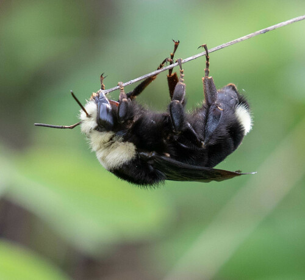

<!-- Lesson Overview -->

# Conservation/ecology Topics 

> - Species distributions 

# Computational Topics
> -  Convert a data frame to a spatial object.
> -  Plot multiple spatial layers.

-------------------------------
```{r load-libraries, echo=FALSE, results="hide", message=FALSE, warning=FALSE}
library(terra)
library(ggplot2)
library(dplyr)
library(sf)
```

# Lab part 1: Oregon bee atlas data exploration 

a. Import the OBA data.
```{r}
OBA_data <- read.csv("OBA_2018-2023.csv")
#head(OBA_data)

```

b. Find the columns related to genus and species and paste them together (with a space between) using the function paste(). Name the new column GenusSpecies.
```{r}

#colnames(OBA_data)
#?paste
#OBA_data$GenusSpecies
OBA_data <- OBA_data %>% 
  mutate(GenusSpecies = paste(OBA_data$Genus,OBA_data$Species, sep = " "))

#colnames(OBA_data)

```

c. Use `sort()` and `unique()` to print the unique values of GenusSpecies in alphabetical order.  How many species are there? 

```{r}
#?sort
length(unique(sort(OBA_data$GenusSpecies)))

```

Some specimens are not identified to species, only genus. How is this reflected in the data? 

This is reflected in the data by having just a space after the genus name.

In two weeks we will learn how to clean this up using regular expressions. 

d. So many bees, so little time. Count up the occurrences of each bee species, and subset the data to bees that have been seen at least two times. 
You can use the tidyverse or any other functions in R that you like. How many "species" are there? 

```{r}

# counting how many times each unique bee shows up and subset data to bees seen at least two times
#(https://stackoverflow.com/questions/24503279/return-df-with-a-columns-values-that-oc# cur-more-than-once)
occur_more_than_twice <-  OBA_data %>% group_by(Species) %>% filter(n()>=2)

# how many ~species are there 
length(unique(occur_more_than_twice$Species))

```

e. Google a few bee names (that have been seen > 2 times) and find one with an a look that resonates with you.

What is the name of your bee? 

Bombus vosnesenskii

Import the photos into Rmarkdown below (hint: googling bee name "discover life" or "inat" can often get you a photo. Many bees will no have any photos :( 




# Lab part 2: Plotting the distrubution of your spirit bee. 

How that have chosen your spirit bee, we would like to plot it's distribution. What is the crs of the data? Annoyingly it is not described anywhere in the spreadsheet (always list your crs in your data) but it is the same as what inat uses because all bees have a georeferenced plant host. If the data is in lat long, it is "unprojected" so only a datum will be listed. 
DATUM: WGS84, unprojected lat long. EPSG code: 4326. 


```{r}
crs("EPSG:4326")
```

a. Extract the X and Y locations for your species only from the data and create a spatial object. Don't forget to set the CRS! 
Hint 1: consider what other data you would like to keep as attributes, for example what flower they were foraging on. Hint 2: Remember the lat is y and long is x. 
Hint 3: You may want to rename the column names you can use, colnames() and reassign the names, since the ones in the oba data spreadsheet are really ugly. 

```{r}

# extracting X and Y locations from our species to create a spatial object

vosnesenskii <- OBA_data %>%
  filter(Species == "vosnesenskii")

#Y <- vosnesenskii$Dec..Lat.
#X <- vosnesenskii$Dec..Long.


# set CRS
#?st_as_sf
vosnesenskii_shp <- st_as_sf(vosnesenskii,
                                   coords = c("Dec..Long.", "Dec..Lat."),
                                   crs = st_crs("EPSG:4326"), na.fail = FALSE	
)

#create a spatial object
st_write(vosnesenskii,
         "vosnesenskii_final.shp", driver = "ESRI Shapefile", append=FALSE)
```

b. Plot your exciting bee data!

```{r plot-data-points}

 ggplot() +
  geom_sf(data = vosnesenskii_shp, color = "hotpink") +
  ggtitle("Map of vosnesenskii Locations")

```

Not so exciting without some kind of background... 

Luckily we can download basemaps into R using the map_data function in ggplot (among many others). There is an example for retrieving the Oregon county polygons. 

```{r plot-or}
or <- map_data("county", "oregon") %>% 
  select(lon = long, lat, group, id = subregion)
# 
# ggplot() +
#   geom_polygon(data=or, aes(x=lon, y=lat, group=group))

```

c. Add your species's points to your choice or an Oregon basemap. 

```{r plot-data-points-basemap}

ggplot() +
  geom_polygon(data=or, aes(x=lon, y=lat, group=group)) +
  geom_sf(data =vosnesenskii_shp , color = "hotpink") 

```
# Lab part 3: Cartography

a. Here is your moment to explore your cartographic skills. 
1. Add another spatial layer relevant to your final project and tweek the Oregon map in anyway that is useful/visually appealing. You may need to crop that layer to the extent of your species's distribution. 
2. Color your points according to some data attribute and add a legend (month collected, county, collector, associated plant, whatever you think is interesting). You may need to circle back to 2.1 to save
additional attributes when you converted the dataframe to a spatial object. 
3. Fine-tune your map: add a title, make sure the legend label makes sense, add a scale bar (google "add scale bar map ggplot" and choose your favorite package). All maps must always have a scale bar. You can add a N arrow as well, though some cartographers argue that is only necessary if N isn't at the top of the map.
4. Write a figure caption for your map explaining any interesting trends you see. 
5. Export you cropped layer to a .shp so you can use it again for your final project.
6. Push this lab to your github repo (just the .Rmd, don't push the data!)

```{r plot-creative}

# adding another spatial layer
  # # extracting X and Y locations from our species to create a spatial object

# 1. add spatial data, ex: lines_HARV <- st_read("data/NEON-DS-Site-Layout-Files/HARV/HARV_roads.shp")
# 1. Add another spatial layer relevant to your final project and tweek the Oregon map in anyway that is useful/visually appealing. You may need to crop that layer to the extent of your species's distribution. 

census_shp <- st_read("CensusBlockGroups/CensusBlockGroups.shp")
# str(census_shp)
# 
# 
# ggplot() +
#   geom_polygon(data=or, aes(x=lon, y=lat, group=group)) +
#   geom_sf(data =vosnesenskii_shp , color = "hotpink") + 
#    geom_sf(data=census_shp, color="blue", alpha=0.5)

# 2. Color your points according to some data attribute and add a legend (month collected, county, collector, associated plant, whatever you think is interesting). You may need to circle back to 2.1 to save
# additional attributes when you converted the dataframe to a spatial object. 
# coloring the polygons by population 

# ggplot() +
#   geom_polygon(data=or, aes(x = lon, y = lat, group = group)) + 
#   scale_fill_viridis_b(option = "plasma", name = "Population", alpha=0.6) + 
#   geom_sf(data = vosnesenskii_shp, color = "yellow", alpha = 0.9) + 
#   geom_sf(data = census_shp, aes(fill = POP20), color = "lightblue", alpha = 0.6)

# the range of values for population density is large
#summary(census_shp$POPDENS20)

# 3. Fine-tune your map: add a title, make sure the legend label makes sense, add a scale bar (google "add scale bar map ggplot" and choose your favorite package). All maps must always have a scale bar. You can add a N arrow as well, though some cartographers argue that is only necessary if N isn't at the top of the map.
library(ggspatial)

ggplot() +
  # map background of Oregon
  geom_polygon(data = or, aes(x = lon, y = lat, group = group)) + 
  # Vosnesenskii points 
    geom_sf(data = vosnesenskii_shp, color = "yellow", alpha = 0.95, size = 0.5) + 
  # census block layer
  geom_sf(data = census_shp, aes(fill = POP20), color = "lightblue", alpha = 0.65) + 
    # filling the blocks based on population AND adding legend for this (using a binned color scale)
    scale_fill_viridis_c(option="turbo", name = "Population", alpha = 0.6) +
    # labels and title
    labs(
      title = "Population by Census Block in Oregon",
      subtitle = "(Including vosnesenskii Distribution)",
      x = "Longitude",
      y = "Latitude",
      caption = "The vosnesenskii seem to be more spread around the western half of Oregon, with most observations being from 120°W to 124°W. But within that longitudinal range, they span the whole latitudinal range of Oregon. Vosnesenskii also don't seem too concerned about differences in population between the different blocks, they look to have similar distributions in places with lower populations and higher populations. "
    ) + 
  theme(plot.caption.position = "plot", plot.caption = element_text(hjust = 0, vjust = 2)) + 
    # adding scale bar
    #?annotation_scale
    annotation_scale(location = "tr") +
  annotation_north_arrow(  height = unit(0.5, "cm"),
  width = unit(0.5, "cm"))
    
# the caption (bc it got cut off) (it's also below!)
  # The vosnesenskii seem to be more spread around the western half of Oregon,
  # with most observations being from 120°W to 124°W. But within that
#longitudinal range, they span the whole latitudinal range of Oregon.
# Vosnesenskii also don't seem too concerned about differences in population
# between the different blocks, they look to have similar distributions in 
# places with lower populations and higher populations.


# 5. Export you cropped layer to a .shp so you can use it again for your final project.

# cropping data
#st_crs(census_shp)
#str(census_shp)
#st_crs(vosnesenskii_shp)

census_shp_2 <- st_as_sf(census_shp,
                                   coords = c("INTPTLON", "INTPTLAT"),
                                   crs = st_crs("EPSG:4326"), na.fail = FALSE)
# matching crs?
census_shp_2 <- st_transform(census_shp_2, st_crs(vosnesenskii_shp))

# cropping
species_dist <- st_bbox(vosnesenskii_shp)
cropped_census_shp <- st_crop(census_shp_2 , species_dist)

# need to rescale ALAND field from sq m to sq km bc its giving an error that there are too many numbers
cropped_census_shp$AWATER <- cropped_census_shp$AWATER / 1e6  # Convert to km²
cropped_census_shp$ALAND <- cropped_census_shp$ALAND / 1e6    # Convert to km²

# rename fields to indicate units
names(cropped_census_shp)[names(cropped_census_shp) == "AWATER"] <- "AWATER_km2"
names(cropped_census_shp)[names(cropped_census_shp) == "ALAND"] <- "ALAND_km2"

# Keep only essential columns, after getting error about the names 
cropped_census_shp <- cropped_census_shp[, c("ALAND_km2", "AWATER_km2", "geometry")]


#create a spatial object
st_write(cropped_census_shp,
         "cropped_census_shp.shp", driver = "ESRI Shapefile", append=FALSE)

```
# the caption (bc it got cut off)
The vosnesenskii seem to be more spread around the western half of Oregon,
with most observations being from 120°W to 124°W. But within that longitudinal
range, they span the whole latitudinal range of Oregon. Vosnesenskii also don't 
seem too concerned about differences in population between the different blocks,
they look to have similar distributions in places with lower populations
and higher populations.


We are looking forward to seeing the maps you create! 

# Lab part 4: Spatial summary statistics
 For your final projects, you will likely need to come up with summary statistics that describes the areas around where bees are captured. 
a. Using the distribution of your chosen bee and the spatial layer you imported in 2.6, extract a meaningful summary statistics from your spatial layer within a buffer of 500, 750 1000 km.
b. Create a plot that illustrates this summary data (box plot, barplot, scatter plot, histogram). 
c. Create a map of your cropped spatial data.

```{r buffers}

# a. using distribution of vonesenskii and the census spatial layer, extracting a meaningful summary statistic from spatial layer
buffer_500 <- st_buffer(vosnesenskii_shp, dist = 500000)
buffer_750 <- st_buffer(vosnesenskii_shp, dist = 750000)
buffer_1000 <- st_buffer(vosnesenskii_shp, dist = 1000000)

#  census_shp to match vosnesenskii_shp CRS
census_shp <- st_transform(census_shp, st_crs(vosnesenskii_shp))

# clip census layer to the buffers
census_500 <- st_crop(census_shp, buffer_500)
census_750 <- st_crop(census_shp, buffer_750)
census_1000 <- st_crop(census_shp, buffer_1000)


# summary statistic of average population density for each buffer
summary_500 <- census_500 %>%
  summarise(
    total_population = sum(POP20, na.rm = TRUE),
    total_land_area = sum(ALAND, na.rm = TRUE) / 1e6,  # convert m² to km²
    avg_population_density = total_population / total_land_area
  )

summary_750<- census_750 %>%
  summarise(
    total_population = sum(POP20, na.rm = TRUE),
    total_land_area = sum(ALAND, na.rm = TRUE) / 1e6,  # convert m² to km²
    avg_population_density = total_population / total_land_area
  )

summary_1000<- census_1000 %>%
  summarise(
    total_population = sum(POP20, na.rm = TRUE),
    total_land_area = sum(ALAND, na.rm = TRUE) / 1e6,  # convert m² to km²
    avg_population_density = total_population / total_land_area
  )


buffer_stats <- data.frame(
  Buffer_Size_km = c(500, 750, 1000),
  Total_Population = c(summary_500$total_population, summary_750$total_population, summary_1000$total_population),
  Total_Land_Area_km2 = c(summary_500$total_land_area, summary_750$total_land_area, summary_1000$total_land_area),
  Avg_Population_Density = c(summary_500$avg_population_density, summary_750$avg_population_density, summary_1000$avg_population_density)
)

ggplot(buffer_stats, aes(x= factor(Buffer_Size_km), y=Total_Population)) +
  geom_bar(stat="identity") +
  labs(
    title = "Total Population Within Buffers",
    x = "Buffer Size (km)",
    y = "Total Population"
  )

# map 

ggplot() +
    geom_polygon(data = or, aes(x = lon, y = lat, group = group)) + 
  geom_sf(data = census_shp, aes(fill = POP20), color = "lightblue", alpha = 0.65) + 
    # filling the blocks based on population AND adding legend for this (using a binned color scale)
  scale_fill_viridis_c(option="turbo", name = "Population", alpha = 0.6) +
  geom_sf(data = buffer_500, fill = NA, color = "blue") +
  geom_sf(data = buffer_750, fill = NA, color = "green") +
  geom_sf(data = buffer_1000, fill = NA, color = "red") +
  geom_sf(data = vosnesenskii_shp, color = "yellow", size = 0.7) +
  labs(
    title = "Bee Distribution and Census Data within Buffers",
    x = "Longitude",
    y = "Latitude"
  )

```