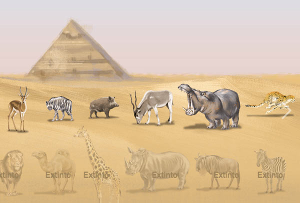
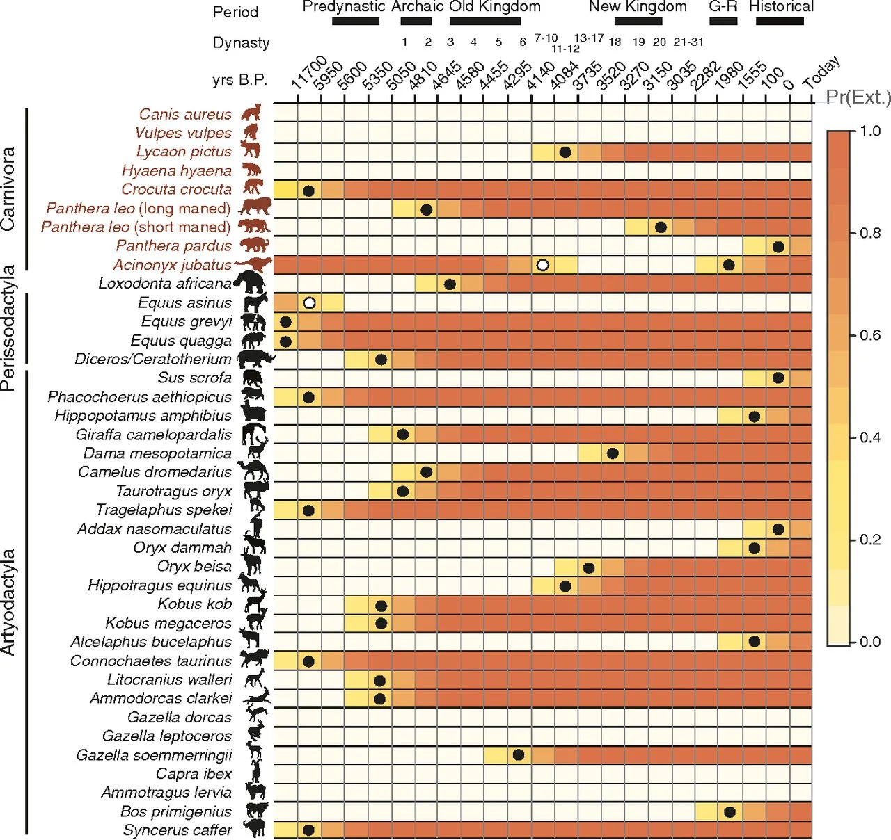

<!-- Lesson Overview -->
# Computational Topics
- Build and visualize food webs 
- Write functions to implement mathematical equations

# Conservation topics
-  Paleofood webs
-  Species extinction

In this lab we will practice our network visualization and manipulation skills using the paleo food web data from [Yeakel et al. 2014](https://doi.org/10.1073/pnas.1408471111). 



See the beautiful, animated version of the graphic above [here](https://infograficos.estadao.com.br/public/cidades/extincoes-egito/)

```{r load-libraries, echo=FALSE, results="hide", message=FALSE, warning=FALSE}
library(igraph)
library(tidyverse)
library(bipartite)
library(networkD3)
```

With some interaction networks we can observe the interactions, for example plant-pollinator networks, seed-disperal networks, human social networks. In food webs sometimes feeding interactions are observed directly, through camera traps, people doing timed observations, and now molecular analysis of gut contents/scat. However, often with food webs people build probabilistic models of who interacts with who based on body size (as in the Yeakel et al. 2014), especially with paleowebs. Thus the data from Yeakel et al. is 1) an occurrence matrix  (Figure 2 from the publication) and a matrix of body sizes (two columns, females then males). We will use these data to build the foodwebs for each time period. This lab is pretty challenging because it will use many of our core programming skills (for loops, writing functions, subsetting data) and our network skills. 

First we will read in the data. The matrix we are reading in has no row or column names, we will have to set them. 

```{r load-data}
sp_occ <- read.table(file="data/egypt_data.txt", header = FALSE)
str(sp_occ)
sp_mass <- read.table(file="data/egypt_mass.txt", header=FALSE)
str(sp_mass)
```


The rows are arranged in the order of Figure 2 of the manuscript. To set the rownames we can make a vector of the names then use the function 'rownames'. We also have to note which species are predators (all those in the species in the Carnivora clade in figure 2). Otherwise we will create a web where giraffes are voracious predators consuming all of the other species (I made this mistake when constructing the networks originally). I have transcribed the data from figure 2 for you: 
 
```{r labels}
row_labs_sp <- c("Canis aureus", "Vulpes vulpes", "Lycaon pictus", "Hyaena hyaena", "Crocuta crocuta", "Panthera leo (long maned)", "Panthera leo (short maned)", "Panthera pardus", "Acinonyx jubatus", "Loxodonta africana", "Equus asinus", "Equus grevyi", "Equus quagga", "Diceros/Ceratotherium", "Sus scrofa",  "Phacochoerus aethiopicus", "Hippopotamus amphibius", "Giraffa camelopardalis", "Dama mesopotamica", "Camelus dromedarius", "Taurotragus oryx", "Tragelaphus spekei", "Addax nasomaculatus", "Oryx dammah", "Oryx beisa", "Hippotragus equinus", "Kobus kob", "Kobus megaceros", "Alcelaphus bucelaphus", "Connochaetes taurinus", "Litocranius walleri", "Ammodorcas clarkei", "Gazella dorcas", "Gazella leptoceros", "Gazella soemmerringii", "Capra ibex", "Ammotragus lervia", "Bos primigenius", "Syncerus caffer")

## Set 1 for predators, 0 for prey  
carnivores <- c(rep(1, 9), rep(0, length(row_labs_sp)- 9))
names(carnivores) <- row_labs_sp
```

# Lab part 1: Creating our foodwebs based on body sizes.

a. Use the above vector of species names to label the row names of the species occurrence and the body size matrices.  The columns of the species occurrence matrix are time points, so we can leave those as V1 etc., but we should set the column names of the mass matrix as "f", "m" (female and male). Use 'head' to check each matrix to see if the names are displayed properly. 

```{r set-labels}

# above species names -> row_labs_sp
  # to label row names of species occurrence and body size matrices
rownames(sp_occ) <- row_labs_sp
# leave columns of species occurence matrixes as V1, V2 etc

# set column names of mass matrix as "f", "m"
colnames(sp_mass) <- c("f", "m")
rownames(sp_mass) <- row_labs_sp


head(sp_occ)
head(sp_mass)

```
Yeakel recommended an updated equation to estimate the probability a predator consumed a prey based on their relative body masses from [Rohr et al. 2010.](https://doi.org/10.1086/653667). The  probability of existence of a trophic link between a predator of body-size $m_i$ and a prey of body-size $m_j$ is given by:


(P($A_{1j}$ = 1) is the probability predator i eats prey j). 

a. Write a function and call it 'probEat' to implement the equation above. Round the probability to two decimal places.

Below are the values of alpha, beta, and gamma for the Serengeti.  In addition, you will need a function to compute the inverse logit function because this equation is for the logit of the probability, so to calculate the 0-1 probability you will need to take the inverse logit of the other side of the equation. Also note, $log^2$ is equivalent to (log($m_i$/$m_j$))^2

```{r inv-logit}
alpha <- 2.51
beta <- 0.79
gamma <- -0.37

inv_logit <- function(x) exp(x)/(1+exp(x))
```

```{r function-mass-comp}
#body-size $m_i$ and a prey of body-size $m_j$ is given by:
probEat <- function(alpha, beta, gamma, mass_1, mass_2){
  
  equation = (alpha) + (beta*log(mass_1/mass_2)) +
    gamma*(log(mass_1/mass_2))^2
  
  # using inv_logit to get a 0 or 1 value
  return (round((inv_logit(equation)), 2))
  
}


```

c. Now create networks of who eats whom. We will start with adjacency matrices. We will assume all of our species are the size of females. For this step, don't worry about predators vs. prey yet, just calculate all of the feeding probabilities based on body sizes.  

Hint: if you start with a square matrix of all zeros (one row and one column for each species), you can use a for loop to fill in that matrix with probabilities calculated from your function above.

```{r create-adj-mat}

# calculate all feeding probabilities based on body sizes
  # assume all species are the size of females 
sp_mass_f <- sp_mass$f

# start with a square matrix of all zeros 
adj_matrix <- matrix(0, nrow = nrow(sp_occ), ncol = nrow(sp_occ))
colnames(adj_matrix) <- rownames(adj_matrix) <- rownames(sp_occ)

 # using for loop to fill the matrix with probabilities from the function above
for (i in 1:length(row_labs_sp)){
  for (j in 1:length(row_labs_sp)) {
   
     adj_matrix[i, j] <- probEat(alpha, beta, gamma, sp_mass_f[i], sp_mass_f[j])
    
  }
}

```

d. Now that you have your matrix of potential feeding interactions based on body size, use the 'carnivores' vector created above to set all of the feeding interactions of herbivores (0s in that vector) to zero. In foodwebs the columns are the higher trophic level and the rows are the lower.
HINT: the function 'sweep' may be useful, though there are many approaches to do the needed matrix multiplication. Print the row and column sums. 

```{r create-adj-mat-2}

# use carnivores vector from above to set all feeding interactions of herbivores to 0


#?sweep
# if not a carnivore? set the interactions of herbivores to 0
  # so using "carnivores" to id which columns will remain the same and which ones will be zeroed 
# https://www.r-bloggers.com/2022/07/how-to-use-the-sweep-function-in-r/
# sweep(x, MARGIN, STATS, FUN)
  # x: Name of the matrix
  # MARGIN: The margin on which to run the function (1 = rows, 2 = columns)
  # STATS: The value(s) to use in the function
  # FUN: The function to perform
# using multiplication bc that will multiply the herbivores by 0, making them 0 
  # TODO confused on whether we're interested in running the function on rows or columns? or does it matter if they both have the same species and number of species?

adj_matrix <- t(adj_matrix)
adj_matrix <- sweep(adj_matrix, 1, carnivores, "*")
adj_matrix <- t(adj_matrix)

# print row/col sums
row_sums <- rowSums(adj_matrix)
col_sums <- colSums(adj_matrix)

print(row_sums)
print(col_sums)

```

# Lab part 2: Breaking the networks into time periods

a. With our matrix of feeding interaction we can create a web for each time period, including only the species that were not extinct in the period. Try first just using the second time period (the second column of 'sp_occ'). 

Use the function 'empty' from the bipartite package to empty the matrix of rows and columns with no interactions. The number of species in the second time period is 36 'sum(sp_occ[,2])'. Check to see that the number of rows in your network with probabilities > 0 is 36. 

HINT: You will need to zero out the rows where a species in not present in that time period and the columns. The function 'sweep' may be useful again.

```{r t1-time-webs}

# create web for each time period
  # incl only species that were not extinct in the period
# try using the 2nd time period/the second column of 'sp_occ'
present_species <- sp_occ[,2]

# using sweep again, in the same way as above?
adj_matrix <- sweep(adj_matrix, 1, present_species, "*")
adj_matrix <- sweep(adj_matrix, 2, present_species, "*")


# using function 'empty' to empty matrix of rows/cols with no interactions
adj_matrix_cleaned <- empty(adj_matrix)

print(nrow(adj_matrix_cleaned))
dim(adj_matrix_cleaned)
```


b. Now create a network for all of the time points by creating a list where each element is a network. You will need to use a for loop, or an 'lapply' if you feel like experimenting with apply functions. Print the first 5 columns and rows of the 5th time period. 

HINT: If choosing the for loop route, remember to create an empty list of a specific length use the function 'vector'. To access a specific element of a list, use [[]], for example cool_list[[1]] accesses the first element of the list.

```{r all-time-webs}

# creating list where each element is a network
  # need to use a for loop or lapply

# function for creating a network for one time period
create_network <- function(adj_matrix, present_species) {
  
  # using sweep to zero out rows/columns for extinct species
adj_matrix <- sweep(adj_matrix, 1, present_species, '*')
adj_matrix <- sweep(adj_matrix, 2, present_species, '*')

# using function 'empty' to empty matrix of rows/cols with no interactions

#adj_matrix_cleaned <- empty(adj_matrix)

return (adj_matrix_cleaned)
  
}

# initialize empty list to store networks 
time_periods <- ncol(sp_occ)
network_list <- vector("list", time_periods)


# using for loop to loop theough each time period to fill network list
for (i in 1:time_periods) {
  
  present_species <- sp_occ[ ,i] # species in the ith time period
  network_list[[i]] <- create_network(adj_matrix, present_species)
  
}

# print first 5 rows and columns of 5th time period
print(network_list[[5]][1:5, 1:5])

```


# Lab part 3: Visualize the networks
a. Convert the adjacency matrices to igraph class objects using the function 'graph_from_adjacency_matrix'. You can use a for loop or an lapply. Because these are food webs, set the argument mode to "directed" and the argument diag to FALSE (this means a species cannot consumer members of its own species, i.e., no canabalism/self-loops). Also remember that these interactions are weighted.  

```{r graphs}

# convert adj matrices to igrpah class objects
  # function: graph_from_adjacency_matrix (x= adj_matrix, mode = "directed", diag = FALSE, weighted = TRUE)
#?graph_from_adjacency_matrix


```

b. Plot three networks of your choice, using different colors for the predators and prey.

```{r plot-g1}
## assign groups as carnivore or herbivore


## convert to a network 3d object

## plot the network


```

```{r plot-g2}

```

```{r plot-g3}

```

